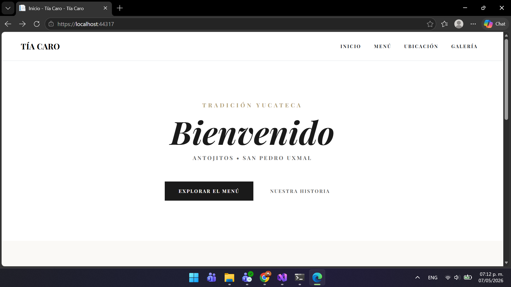
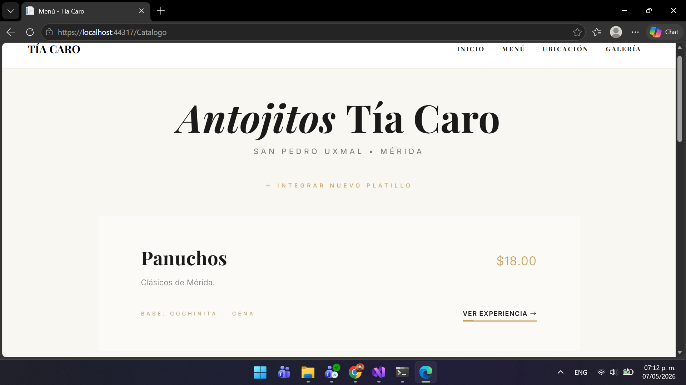

# 📘 Arquitectura de Software - Práctica 1

## 👨‍💻 Información del Estudiante

- **Nombre:** Joaquin Uriona
- **Matrícula:** SW2509057
- **Grupo:** A
- **Cuatrimestre:** Tercer Cuatrimestre
- **Carrera:** TSU en Desarrollo e Innovación de Software
- **Profesor:** Jorge Javier Pedrozo Romero

---

## 📋 Descripción del Proyecto

Este repositorio contiene el código fuente de **Antojitos de la Tía Caro**, una aplicación web desarrollada en **C# con ASP.NET Core MVC**, el proyecto implementa una interfaz de usuario (UI) de estilo *"lujoso"* y diseño editorial, construida para presentar un catálogo gastronómico interactivo.

---

### 📸 Capturas de Pantalla
> **Nota:** Aquí puedes ver la interfaz principal y las secciones clave de la plataforma.

| Home / Bienvenida | Catálogo Editorial |
|---|---|
|  |  |

---

## 📁 Estructura del Proyecto

```
Catalogo/
│
├── Areas/
│   └── Identity/           # Gestión de usuarios, login y registro (ASP.NET Identity)
│       └── Pages/          # Páginas Razor para la interfaz de autenticación
│
├── Controllers/            # Lógica de Control (C#)
│   ├── HomeController.cs   # Maneja la navegación principal (Inicio, Contacto)
│   ├── MenuController.cs   # Lógica para filtrar y mostrar platillos
│   └── GaleriaController.cs # Gestión de la vista de visuales y contenido multimedia
│
├── Data/                   # Capa de Acceso a Datos
│   ├── ApplicationDbContext.cs # Configuración de Entity Framework y tablas SQL
│   └── Migrations/         # Historial de cambios en la base de datos
│
├── Models/                 # Entidades del Dominio (POO)
│   ├── Platillo.cs         # Atributos: Nombre, Precio, Descripción, Categoría
│   └── Galeria.cs          # Atributos: ImagenUrl, Título, Fecha de captura
│
├── Properties/             # Configuraciones de lanzamiento del servidor (launchSettings.json)
│
├── Views/                  # Interfaz de Usuario (Razor HTML)
│   ├── Home/               # Vistas de la página de aterrizaje (Index.cshtml)
│   ├── Menu/               # Vista del catálogo editorial de platillos
│   ├── Galeria/            # Vista de la cuadrícula de imágenes
│   └── Shared/             # Componentes reutilizables (_Layout, _Footer, _Navbar)
│
├── wwwroot/                # Recursos Estáticos (Frontend)
│   ├── css/                # Hojas de estilo modulares
│   │   ├── layout.css      # Estructura global y variables de color
│   │   ├── menu.css        # Diseño de cartas y efectos hover
│   │   └── galeria.css     # Grid de imágenes y efectos de zoom
│   ├── js/                 
│   │   └── site.js         # Lógica de Scroll Reveal y Glassmorphism
│   ├── img/                
│   │   ├── logo/           # Branding de Tía Caro
│   │   ├── platillos/      # Fotos del catálogo
│   │   └── galeria/        # Fotos de la sección visuales
│   └── lib/                # Librerías externas (Bootstrap, jQuery)
│
├── Program.cs              # Punto de entrada de la app y configuración de servicios
├── appsettings.json        # Cadenas de conexión (SQL Server) y secretos
├── Catalogo.csproj         # Archivo de proyecto (Dependencias y versiones de .NET)
├── .gitignore              # Archivos excluidos del control de versiones (bin/obj/etc)
└── README.md               # Documentación técnica del proyecto
```

---

### 🛠️ Tecnologías Utilizadas
* **Backend:** ASP.NET Core 8.0 (C#)
* **Arquitectura:** MVC (Model-View-Controller)
* **Frontend:** HTML5, CSS3 (Custom Grid & Flexbox), Vanilla JavaScript
* **Tipografías:** Playfair Display e Inter (vía Google Fonts)
* **Herramientas:** Visual Studio 2022, Git, WSL (Windows Subsystem for Linux)

---

## 🎯 Próximos Pasos

Implementaciones Mínimas y Estado
Lista de características completadas y próximos pasos para la evolución técnica del proyecto:

[x]  Diseño UI/UX con estética Fine Dining .

[x]  Animaciones fluidas, Scroll Reveal y Glassmorphism con Vanilla JS.

[x]  Sistema de galería y catálogo responsivo con CSS Grid.

[ ]  Conexión a Base de Datos relacional .

[ ]  Implementación de Autenticación (Login) y Roles de usuario.

[ ]  Desarrollo del Panel de Administración .

---

## 🤝 Agradecimientos

- **Profesor Jorge Javier Pedrozo Romero** por la estructura del curso y la práctica
- **Tecnológico de Software** por la formación integral

---

## 📧 Contacto

- **Email Institucional:** joaquin.uriona@tecdesoftware.edu.mx
- **GitHub:** [Joako601](https://github.com/TU-USUARIO)

---

## 📄 Licencia

Este proyecto fue desarrollado por **Joaquin Uriona** como parte de las prácticas académicas para el **Tecnológico de Software**. 

Distribuido bajo la Licencia MIT. Siéntete libre de utilizar la arquitectura del código y el diseño de la interfaz para fines educativos o proyectos personales, siempre y cuando se mantenga el reconocimiento al autor original. 

Consulta el archivo `LICENSE` para más detalles.

---

<div align="center">

**⭐ Si te gustó este proyecto, dale una estrella ⭐**

Hecho con 💙 por Joaquin Uriona - 2026

</div>
